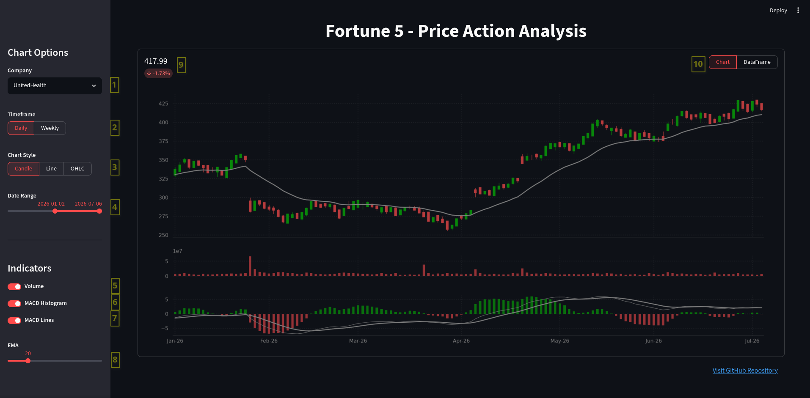
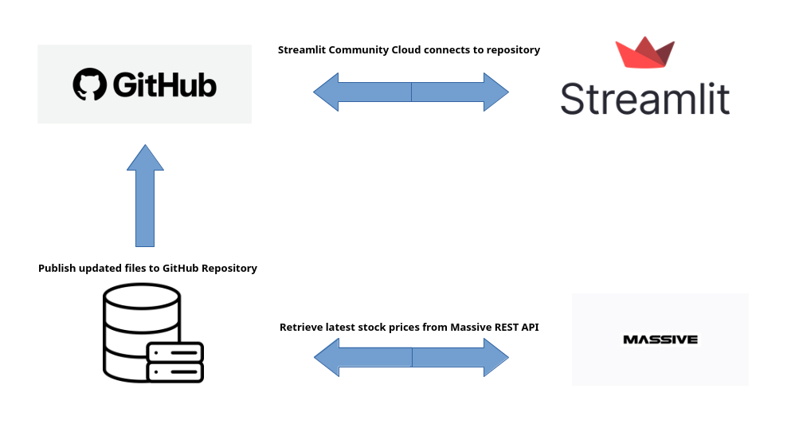

# Overview
Every year, the Fortune 500 publishes the largest US corporations by total revenue. This project focuses on the top 5.
- Amazon
- Walmart
- UnitedHealth Group
- Apple
- Alphabet

My Streamlit Dashboard visualizes the stock market price action data (open, high, low, close, volume) and provides a few of the most popular indicators (MACD, EMA) to help contextualize the movement.

# Features
Let's do a quick breakdown of the features/widgets on the dashboard:



1. Select the company you wish to analyze from the dropdown menu.
2. Pick your desired timeframe aggregation (daily or weekly).
3. Choose the chart style for the OHLC data.
4. Expand or focus your analysis with the date range slider.
5. Toggle the visibility for the volume bar chart.
6. Toggle this visibility for the MACD histogram.
7. Overlay the MACD lines (Signal and Fast) over the MACD plot area.
8. Select a custom EMA period to overlay on the OHLC plot area.
9. Get a quick metric of the latest closing price and its comparison to the previous period.
10. Convert chart data to a downloadable .csv view.

# ETL Diagram
To get the relevant stock data, I designed ETLs that leverage the [Massive's RESTful API Service](https://massive.com/docs/rest/stocks/overview). A free account is offered five free calls a minute, hence the scope of this project being the top five companies in the US. The [Daily](ETLs/get_daily.py) and [Weekly](ETLs/get_weekly.py) ETLs are scheduled to run daily after the market close. They syndicate their updated files to this repository where the Streamlit Cloud can access.



# Repository Structure
```bash
.
├── Assets
│   └── Data
│       ├── Daily
│       │   ├── AAPL.csv
│       │   ├── AMZN.csv
│       │   ├── GOOGL.csv
│       │   ├── UNH.csv
│       │   └── WMT.csv
│       └── Weekly
│           ├── AAPL.csv
│           ├── AMZN.csv
│           ├── GOOGL.csv
│           ├── UNH.csv
│           └── WMT.csv
├── Docs
│   ├── Dashboard.png
│   └── Diagram.png
├── ETLs
│   ├── get_daily.py
│   └── get_weekly.py
├── .gitignore
├── main.py
├── README.md
├── requirements.txt
├── Static
│   ├── company.py
│   └── layout.py
├── .streamlit
│   └── config.toml
└── Utils
    ├── chart_utils.py
    ├── df_utils.py
    └── st_utils.py

10 directories, 25 files
```

